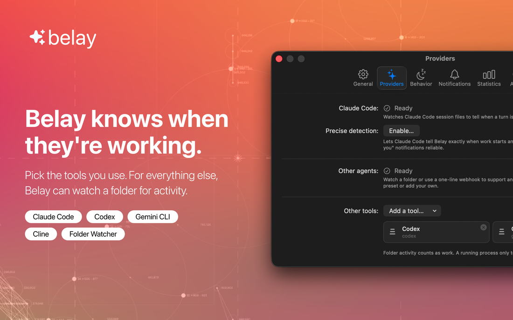
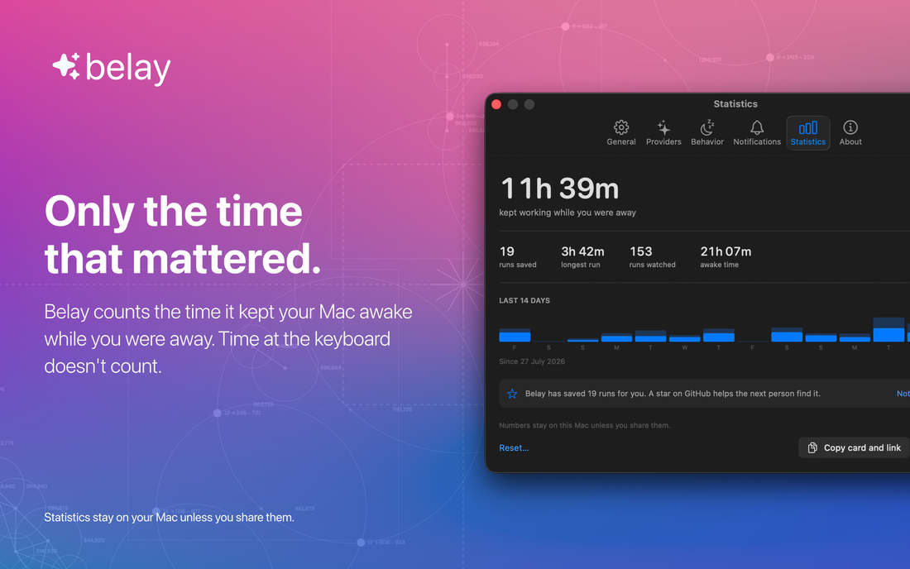
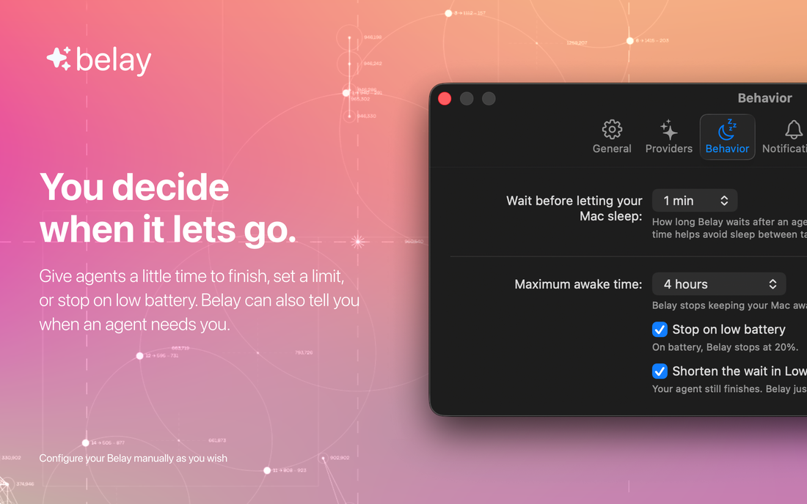
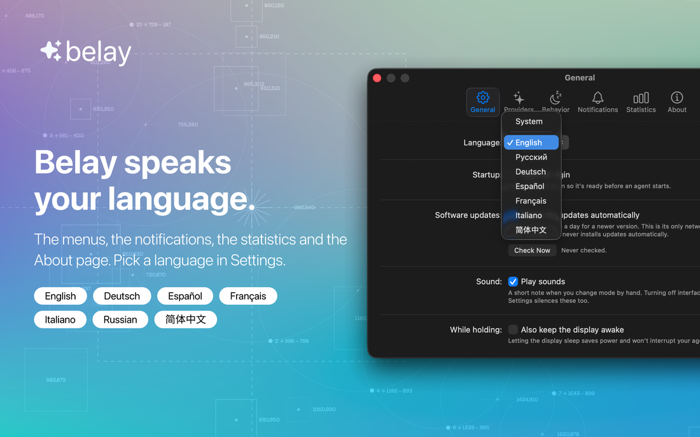

<div align="center">


<br>

[](https://github.com/PerfectoWeb/Belay/releases/latest/download/Belay.dmg)
[](https://perfectoweb.github.io/Belay/)


[](https://github.com/PerfectoWeb/Belay/actions)
[](https://github.com/PerfectoWeb/Belay/releases)
[](LICENSE)

**Your Mac stays awake exactly as long as your AI coding agent is working — and not a minute longer.**

No API key · No account · Nothing leaves your Mac

</div>

<br>

<div align="center">
  
</div>

<br>

## 📚 What is it?

You start a long Claude Code task and walk away. Ten minutes later your Mac
sleeps, the run dies, and you come back to nothing. So you set sleep to
**Never**, forget to change it back, and your laptop cooks itself for a week.

Belay is a macOS menu bar app that fixes exactly that, and nothing else. It
watches your local coding agents, holds the Mac awake **only while one is
genuinely working**, and hands sleep straight back the moment everything goes
quiet. Your System Settings are never touched.

The trade-off it is tuned around is lopsided on purpose: sleeping sixty seconds
too early kills a long run silently and wastes an evening, while staying awake
sixty seconds too long costs nothing at all.

## ✨ Features

| | |
|---|---|
| 🎯 **Zero setup for Claude Code** | It is detected automatically. Nothing to configure, no key to paste. |
| 🔌 **Codex, Gemini CLI, Cline, Aider** | Ship as presets. Anything else: watch a folder, watch a process, or send a webhook. |
| 🛡 **It cannot get stuck on** | Every hold expires by itself after 120 seconds unless Belay re-arms it. Crash it, force-quit it, kill it — your Mac is back to normal within two minutes. |
| 🔋 **Rails you choose** | A cap on continuous awake time, a battery floor, and release on sleep, quit and mode change. |
| 👀 **Subagent aware** | Parallel subagents are counted as the one session they belong to, not as noise. |
| 📊 **It counts what it saved** | Time held while you were away from the keyboard — the only time that was ever at risk. |
| 🔒 **Nothing leaves your Mac** | No account, no telemetry. One daily version check, carrying nothing about you, and one switch turns it off. |
| 🌍 **Seven languages** | English, Русский, Deutsch, Español, Français, Italiano, 简体中文. |

## 📦 Install

### Direct download — the way most people should

<div align="center">

### [⬇️ Download Belay.dmg](https://github.com/PerfectoWeb/Belay/releases/latest/download/Belay.dmg)

macOS 14 or later · Apple silicon and Intel · about 4 MB

</div>

Open the disk image and drag **Belay** to Applications. That is the whole
install.

The app and the disk image are both signed with a Developer ID and **notarized
by Apple**, and both carry a stapled ticket — so the first launch works with no
network and without the right-click-Open dance.

<details>
<summary><b>Other ways to install</b></summary>

#### From the Mac App Store

Coming. The sandboxed build exists and is what the App Store target builds; the
listing is not up yet.

#### Build it yourself

No Apple Developer account needed:

```bash
git clone https://github.com/PerfectoWeb/Belay.git && cd Belay
scripts/build-local.sh
open build/Belay.app
```

Needs Xcode 16 or later, plus `xcodegen`, `swiftlint` and `swift-format` from
Homebrew. The result is ad-hoc signed, which means it runs on your Mac and will
not open on anyone else's without a right-click.

#### Verify what you downloaded

```bash
spctl -a -vvv -t install /Applications/Belay.app
codesign -dv --verbose=2 /Applications/Belay.app
```

You should see `source=Notarized Developer ID` and team `VSY2EB4Y9E`.

</details>

## 🚀 How to Use

**1. Launch it.** One welcome screen explains what Belay reads. Then it lives in
the menu bar — there is no Dock icon and no window.

**2. Leave it in Auto.** That is the whole product. Belay holds the Mac awake
while an agent is working and lets it sleep when nothing is.

| Mode | What it does |
|---|---|
| 🪄 **Auto** *(default)* | Awake if and only if an agent is working |
| ☀️ **Always On** | A better `caffeinate`, with the same safety rails |
| 🌙 **Off** | Belay holds nothing |

**3. Left-click the menu bar icon** for the panel: what is running, for how
long, and — when Belay is *not* holding — the reason, in plain language.
Right-click for a compact menu.

**4. Check it yourself, any time.** Belay never asks to be trusted:

```bash
pmset -g assertions | grep "pid $(pgrep -x Belay)("
```

You will see the assertion, a plain-English reason, and how long it has left.

> **Adding a tool Belay has never heard of** takes one line — if it can run a
> shell command, it can talk to Belay. See
> [`docs/HOW-IT-WORKS.md`](docs/HOW-IT-WORKS.md#talking-to-belay-from-anything).

## 🖼 Screenshots

<table>
<tr>
<td width="50%"></td>
<td width="50%"></td>
</tr>
<tr>
<td width="50%"></td>
<td width="50%"></td>
</tr>
</table>

## 🧯 Troubleshooting

<details>
<summary><b>My Mac still went to sleep</b></summary>

Open the panel — it always says why in plain language. The usual answers are
the battery guard, the maximum awake time, or that Belay did not think anything
was running. If it is the last one and your agent *was* working, that is a bug
worth reporting: include the tool and the macOS version.

</details>

<details>
<summary><b>It does not work with the lid closed</b></summary>

Nothing can make it. An idle-sleep assertion does not keep a MacBook awake with
the lid shut — macOS enters clamshell sleep unless the machine is on AC power
with an external display attached. Belay will not pretend otherwise.

</details>

<details>
<summary><b>My screen still turns off</b></summary>

That is intentional and saves real power. Belay prevents *system* sleep; the
machine underneath keeps working. There is a setting to keep the display awake
too, off by default.

</details>

<details>
<summary><b>Belay does not see my agent</b></summary>

Claude Code needs no setup. Everything else is configured in **Settings ▸
Providers**: switch on a preset, or point the folder watcher at wherever your
tool writes while it works. If your tool can run a shell command, the webhook in
[`docs/HOW-IT-WORKS.md`](docs/HOW-IT-WORKS.md#talking-to-belay-from-anything) is
one line.

</details>

<details>
<summary><b>It says "needs setup"</b></summary>

A preset's path did not exist on your machine. Presets are configuration, not
code — open Settings ▸ Providers and correct the path. A wrong preset costs one
edit, never a release.

</details>

<details>
<summary><b>Something else</b></summary>

[Open an issue.](https://github.com/PerfectoWeb/Belay/issues) The macOS version
and the agent you were running are the two things that make a report
actionable. [`docs/QA-CHECKLIST.md`](docs/QA-CHECKLIST.md) lists what has and
has not been exercised on a real machine — macOS 14 and 15 are still on the
second list.

</details>

## 💬 Support & Contributions

Belay is free and always will be. The most useful things, in order:

⭐ **A star.** It costs nothing and it is how other people find this.

🐛 **A bug report.** Especially one with the macOS version and the agent you
were running.

🌍 **A translation read by someone who actually speaks it.** Seven languages
ship and only English and Russian have been read properly by a person. One CSV
per language in [`Localization/`](Localization/), and
[`CONTRIBUTING.md`](CONTRIBUTING.md) explains the round trip. This is the single
most wanted contribution, and it is data rather than code.

🔌 **A preset for an agent Belay does not know yet.** Also data, also no need to
learn the codebase.

💛 **Money, last.** There is a Donate link in the app and on the site, and it is
deliberately the least interesting item on this list.

Start at [`CONTRIBUTING.md`](CONTRIBUTING.md). Security reports go through
[`SECURITY.md`](SECURITY.md), not the issue tracker.

### 📖 Documentation

| | |
|---|---|
| [How it works](docs/HOW-IT-WORKS.md) | Detection, the safety rails, privacy, and talking to Belay from anything |
| [FAQ](docs/FAQ.md) | Why not `caffeinate`, why not CPU, why not an API key |
| [Contributing](CONTRIBUTING.md) | Building, testing, translating, adding a preset |
| [Architecture](docs/02-ARCHITECTURE.md) | How the app is put together |
| [Security](SECURITY.md) | What Belay reads, what it cannot read, and how to verify it |
| [Changelog](CHANGELOG.md) | What changed, and why |

## 📝 License

[MIT](LICENSE) — fork it, rename it, sell it.

The **name and the mark** are not covered by that licence;
[`TRADEMARKS.md`](TRADEMARKS.md) says exactly what that does and does not stop
you doing.

Belay shows each tool's own logo in the sessions list so you can tell at a
glance which agent is working. All product names, logos and trademarks are the
property of their respective owners, used only to identify those products, and
imply no affiliation or endorsement. See [`NOTICE.md`](NOTICE.md).

<div align="center">
<br>
<sub>Built for people who leave their agents running and go and do something else.</sub>
</div>
