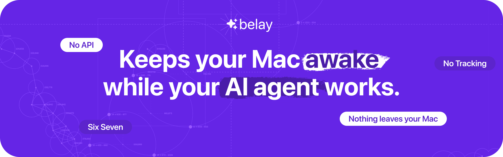
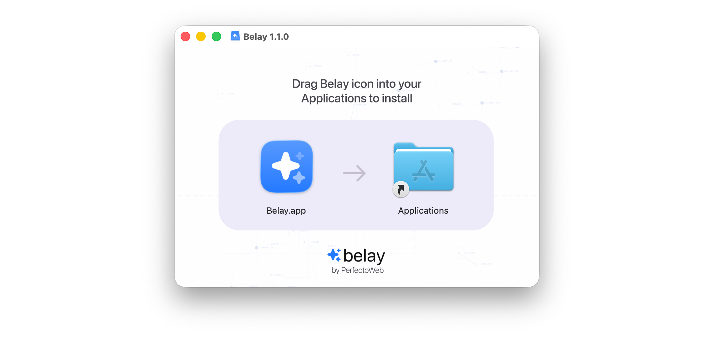
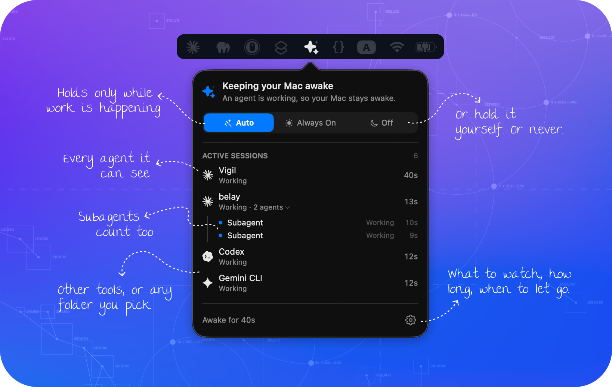
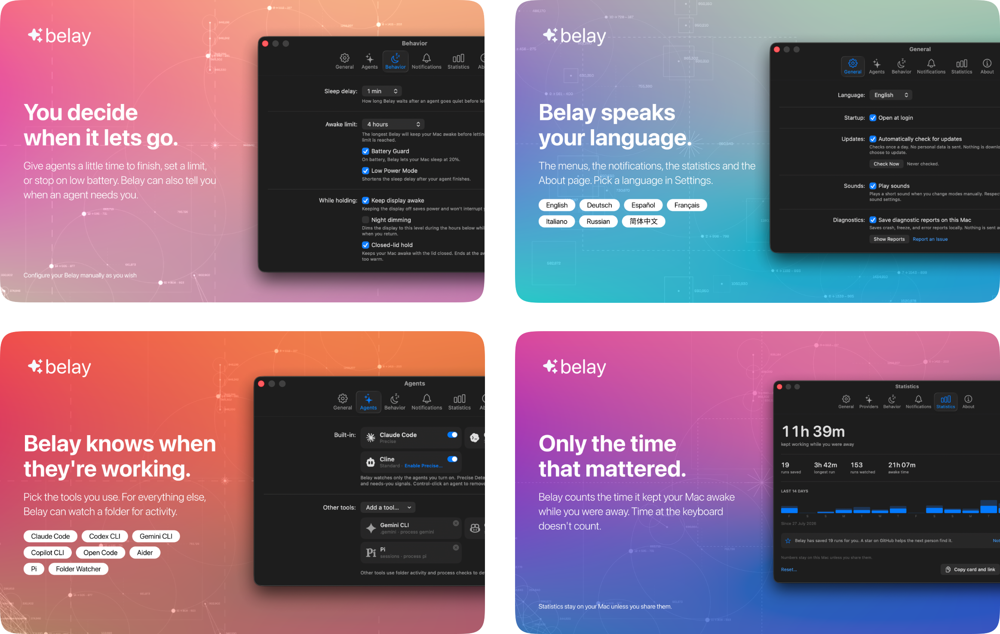

<div align="center">

<picture><source media="(max-width: 500px)" srcset="Promo/Social/masthead-2x-mobile.png"></picture>


[](https://github.com/PerfectoWeb/Belay/releases/latest)
[](https://github.com/PerfectoWeb/Belay/actions)


<a href="https://github.com/PerfectoWeb/Belay/releases/latest/download/Belay.dmg"><picture><source media="(min-width: 501px)" srcset="Promo/Social/btn-download-green-desk.png"></picture></a><picture><source media="(max-width: 500px)" srcset="Promo/Social/spacer.png"></picture><a href="https://perfectoweb.github.io/Belay/"><picture><source media="(min-width: 501px) and (prefers-color-scheme: dark)" srcset="Promo/Social/btn-site-dark-desk.png"><source media="(min-width: 501px)" srcset="Promo/Social/btn-site-light-desk.png"><source media="(prefers-color-scheme: dark)" srcset="Promo/Social/btn-site-dark.png"></picture></a>

</div>

**Keep your Mac awake *only* while your coding agents are working.**

Claude Code, Codex, Cline and Copilot CLI are detected locally, without reading
your prompts or code. Belay holds macOS awake while work is active, then lets
your Mac sleep normally the moment the agent stops or waits for you.
Free for macOS · DMG · Homebrew · Mac App Store · Source available.

<!-- The 15-second demo lands here once the montage is done. -->

## 📚 What is it?

You start a long Claude Code, Codex, Cline, or Copilot CLI task and walk away. Ten minutes later your 
Mac sleeps, the run stops making progress, and you come back to unfinished work.

Belay is a macOS menu bar app that fixes exactly that. It watches your local
coding agents, keeps the Mac awake while work is still happening, and lets it
sleep normally again when the work is done.

No timer to start. No sleep setting to remember to change back.

### Why not just `caffeinate`?

`caffeinate` is great when you know exactly what command should keep the Mac
awake, for how long. Belay is for the opposite workflow: coding agents start,
wait for you, resume and finish on their own schedule. Belay follows that work
state and releases the Mac automatically — no terminal flag to remember, no
hold left running overnight.

## ✨ Features

<table>
<tr><td width="21%">🎯&nbsp;<b>Zero&nbsp;setup</b></td><td>Claude Code, Codex, Cline and Copilot CLI are detected automatically. Nothing to configure, no key to paste.</td></tr>
<tr><td>🔌&nbsp;<b>More&nbsp;agents</b></td><td>Gemini CLI, OpenCode, Cline (VS&nbsp;Code), Aider and Pi ship as presets. For anything else, watch a folder or process, or connect it yourself in the direct build.</td></tr>
<tr><td>🗂&nbsp;<b>Any&nbsp;folder&nbsp;home</b></td><td>Agents using custom config folders (<code>CLAUDE_CONFIG_DIR</code> and friends) or several profiles: add each folder in the agent's settings and Belay watches them all.</td></tr>
<tr><td>⚡&nbsp;<b>Precise&nbsp;detection</b></td><td>In the direct build, every built-in agent can report the exact moment work starts, finishes or waits for you — Copilot does it out of the box, the rest with one click in Settings and a full preview before anything is written.</td></tr>
<tr><td>🛡&nbsp;<b>Lets&nbsp;go</b></td><td>Normal holds expire after 120 seconds unless Belay renews them. If Belay disappears, the Mac goes back to normal by itself.</td></tr>
<tr><td>⏱&nbsp;<b>Timed&nbsp;holds</b></td><td>Always On can run for a chosen time — 15 minutes to 12 hours, or your own — with the countdown in the panel and on the dimmed screen. The timer survives a relaunch.</td></tr>
<tr><td>🔋&nbsp;<b>Safety&nbsp;limits</b></td><td>Set a maximum awake time and a battery floor. Belay also lets go on sleep, quit and mode changes.</td></tr>
<tr><td>👀&nbsp;<b>Agent&nbsp;teams&nbsp;too</b></td><td>Claude Code subagents and Cline teammate agents appear under their session in the panel, and count as part of it, not as noise.</td></tr>
<tr><td>🌙&nbsp;<b>Night&nbsp;dimming</b></td><td>While holding at night, Belay can dim the display to a chosen level on your schedule, show the timer's countdown on the dark screen, and restore brightness the moment you come back.</td></tr>
<tr><td>💤&nbsp;<b>Closed-lid&nbsp;hold</b></td><td>Opt-in for the direct build: keep working with the lid closed, ending at the awake limit or if the Mac runs hot.</td></tr>
<tr><td>📊&nbsp;<b>Time&nbsp;saved</b></td><td>Belay counts the time it kept your Mac awake while you were away, when sleep could actually have interrupted the work.</td></tr>
<tr><td>🔒&nbsp;<b>Stays&nbsp;local</b></td><td>Agent detection stays on your Mac. No account, analytics or telemetry. Direct builds can check GitHub once a day for updates; you can turn that off.</td></tr>
<tr><td>🌍&nbsp;<b>Multilingual</b></td><td>English, Русский, Deutsch, Español, Français, Italiano, 简体中文.</td></tr>
</table>

## 📦 Install

**1.** <a href="https://github.com/PerfectoWeb/Belay/releases/latest/download/Belay.dmg"><b>Download Now</b></a><sup><a href="https://github.com/PerfectoWeb/Belay/releases/latest"></a></sup> macOS 14 or later, Apple silicon and Intel, under 15 MB.

**2.** Open the disk image and drag **Belay** into Applications.

<picture><source media="(max-width: 768px) and (prefers-color-scheme: dark)" srcset="Promo/Social/dmg-window.png"><source media="(max-width: 768px)" srcset="Promo/Social/dmg-window-light.png"><source media="(prefers-color-scheme: dark)" srcset="Promo/Social/dmg-window-wide.png"></picture>

**3.** That is the install. Launch it and it lives in the menu bar.

The app and the disk image are both signed with a Developer ID and **notarized
by Apple**, and both carry a stapled ticket, so the first launch works with no
network and without the right-click-Open dance.

#### 🍺 Prefer the terminal?

```bash
brew install --cask perfectoweb/tap/belay
```

`brew upgrade` keeps it current afterwards. It installs the same signed,
notarized disk image the button above gives you, and Homebrew checks its
SHA-256 before it opens it. The cask lives in
[our own tap](https://github.com/PerfectoWeb/homebrew-tap) until Belay clears
homebrew-cask's notability bar — same command shape, one extra word.

<details>
<summary><b>Other ways to install</b></summary>

#### 🍎 From the Mac App Store

[**Belay - Awake for AI Agents**](https://apps.apple.com/app/belay-awake-for-ai-agents/id6801207644),
free, macOS 14 or later. The sandboxed build, so it updates through the store
rather than through Sparkle and has no network access at all.

#### 🔨 Build it yourself

No Apple Developer account needed:

```bash
git clone https://github.com/PerfectoWeb/Belay.git && cd Belay
scripts/build-local.sh
open build/Belay.app
```

Needs Xcode 16 or later, plus `xcodegen`, `swiftlint` and `swift-format` from
Homebrew. The result is ad-hoc signed, which means it runs on your Mac and will
not open on anyone else's without a right-click.

#### 🔎 Verify what you downloaded

```bash
spctl -a -vvv -t install /Applications/Belay.app
codesign -dv --verbose=2 /Applications/Belay.app
```

You should see `source=Notarized Developer ID` and team `VSY2EB4Y9E`.

</details>

## 🚀 How to Use

**1. Launch it.** One welcome screen explains what Belay reads. Then it lives in
the menu bar. There is no Dock icon and no window.

**2. Leave it in Auto.** That is the whole product. Belay holds the Mac awake
while an agent is working and lets it sleep when nothing is.

| Mode | What it does |
|---|---|
| 🪄 **Auto** *(default)* | Keeps your Mac awake while an agent is working |
| ☀️ **Always On** | Keeps it awake until you turn it off |
| 🌙 **Off** | Belay stays out of the way |

**3. Left-click the menu bar icon** for the panel: what is running, for how
long, and, when Belay is *not* holding, the reason in plain language.
Right-click for a compact menu.

<p align="center">
  
</p>

**4. Check it yourself, any time.** Belay never asks to be trusted:

```bash
pmset -g assertions | grep "pid $(pgrep -x Belay)("
```

You will see the assertion, a plain-English reason, and how long it has left.

> **Adding a tool Belay has never heard of** takes one line. If it can run a
> shell command, it can talk to Belay. See
> [`docs/HOW-IT-WORKS.md`](docs/HOW-IT-WORKS.md#talking-to-belay-from-anything).

## 🖼 Screenshots

<picture><source media="(max-width: 500px)" srcset="Promo/Social/shots/stack.png"></picture>

## 🧯 Troubleshooting

<details>
<summary><b>My Mac still went to sleep</b></summary>

Open the panel. It always says why in plain language. The usual answers are
the battery guard, the maximum awake time, or that Belay did not think anything
was running. If it is the last one and your agent *was* working, that is a bug
worth reporting: include the tool and the macOS version.

</details>

<details>
<summary><b>It does not work with the lid closed</b></summary>

Out of the box, no: an idle-sleep assertion does not keep a MacBook awake with
the lid shut. macOS enters clamshell sleep unless the machine is on AC power
with an external display attached.

Since 1.3 the direct build can, as an opt-in. **Keep working with the lid
closed** in Settings installs a system helper – macOS asks for your approval –
that holds
the OS's own sleep switch while an agent is working, and always lets go by
itself: when the work ends, when Belay stops asking for it, after a hard time
cap, or the moment the Mac runs hot with the lid shut. Proven on battery with
no display attached, and the control run without it slept in seventy seconds.

The App Store build cannot install a privileged helper (that is Apple's rule,
and a good one), so it does not offer the switch.

</details>

<details>
<summary><b>My screen still turns off</b></summary>

That is intentional and saves real power. Belay prevents *system* sleep; the
machine underneath keeps working. There is a setting to keep the display awake
too, off by default – and since 1.3, one to dim it to a glow at night while
it is kept awake, so a screen held for an overnight run does not light an
empty room. It brightens back the moment you return.

</details>

<details>
<summary><b>Belay does not see my agent</b></summary>

Claude Code, Codex, Cline and Copilot CLI need no setup, and if yours runs
from a custom config folder or a second profile, add that folder from the
agent's own settings. Everything else is configured in **Settings ▸ Agents**:
switch on a preset – Gemini CLI, OpenCode, Aider, Cline (VS Code) and Pi ship
ready-made – or point Belay at a folder or process your tool uses while it
works.

In the direct build, tools that can run a shell command can also talk to Belay
directly. See
[`docs/HOW-IT-WORKS.md`](docs/HOW-IT-WORKS.md#talking-to-belay-from-anything).

</details>

<details>
<summary><b>It says "needs setup"</b></summary>

Since 1.3.2 the badge says which case you are in: a folder that does not exist
yet simply has not been created by the tool (it appears after the first run),
and only a folder that exists but cannot be read is an access question.
Presets are configuration, not code, so open Settings ▸ Agents and correct
the path if yours lives elsewhere. A wrong preset costs one edit, never a
release.

</details>

<details>
<summary><b>Something else</b></summary>

[Open an issue.](https://github.com/PerfectoWeb/Belay/issues) The macOS version
and the agent you were running are the two things that make a report
actionable. [`docs/QA-CHECKLIST.md`](docs/QA-CHECKLIST.md) lists what has and
has not been exercised on a real machine; macOS 14, 15 and 26 have all been
run for real.

</details>

## 💬 Support & Contributions

Belay is free and always will be. The most useful things, in order:

⭐ **Belay helped?** If it saved one of your long agent runs from a sleeping
Mac, a [star](https://github.com/PerfectoWeb/Belay) helps other Mac users
find it.

🐛 **[Report a bug](https://github.com/PerfectoWeb/Belay/issues/new)**. The
macOS version and the agent you were running are what make a report actionable.

🌍 **[Fix a translation](Localization/)**. Belay is multilingual, and only
English and Russian have been read by a person who speaks them. One CSV per
language, and it is data rather than code. This is the most wanted contribution
here.

🔌 **[Add a preset](docs/CONTRIBUTING.md)** for an agent Belay does not know yet.
Also data, also no need to learn the codebase.

💛 **[Donate](https://perfecto-web.com/d/)**. Last on the list on purpose.

Start at [`docs/CONTRIBUTING.md`](docs/CONTRIBUTING.md). Security reports go through
[`docs/SECURITY.md`](docs/SECURITY.md), not the issue tracker.

### 📖 Documentation

<table>
<tr><td width="24%"><a href="docs/HOW-IT-WORKS.md">How it works</a></td><td>Detection, the safety rails, privacy, and talking to Belay from anything</td></tr>
<tr><td width="24%"><a href="docs/FAQ.md">FAQ</a></td><td>Why not <code>caffeinate</code>, why not CPU, why not an API key</td></tr>
<tr><td width="24%"><a href="docs/CONTRIBUTING.md">Contributing</a></td><td>Building, testing, translating, adding a preset</td></tr>
<tr><td width="24%"><a href="docs/02-ARCHITECTURE.md">Architecture</a></td><td>How the app is put together</td></tr>
<tr><td width="24%"><a href="docs/SECURITY.md">Security</a></td><td>What Belay reads, what it cannot read, and how to verify it</td></tr>
<tr><td width="24%"><a href="CHANGELOG.md">Changelog</a></td><td>What changed, and why</td></tr>
<tr><td width="24%"><a href="docs/ROADMAP.md">Roadmap</a></td><td>Where Belay is going, and what has to be true first</td></tr>
</table>

## 📝 License

**[Belay Source-Available License 1.0](LICENSE)**. Use it anywhere, fork it,
build on it. Two conditions:

🚫 **You may not sell it.** Not the app, not a derivative, not access to it. Use
is free and stays free for everyone, including at work and for commercial work.
What is forbidden is charging other people for it.

📛 **Credit the original.** Anything built on Belay has to say so where its users
can see it: *Belay by PerfectoWeb*, with a link back here.

Ten common questions, answered plainly: [`docs/LICENSE-FAQ.md`](docs/LICENSE-FAQ.md).

The **name and the mark** are covered separately.
[`docs/TRADEMARKS.md`](docs/TRADEMARKS.md) explains what that does and does not
stop you doing.

Belay shows each tool's own logo in the sessions list so you can tell at a
glance which agent is working. All product names, logos and trademarks are the
property of their respective owners, used only to identify those products, and
imply no affiliation or endorsement. See [`NOTICE.md`](NOTICE.md).

<div align="center">
<br>
<sub>Built for people who leave their agents running and go and do something else.</sub>
</div>
